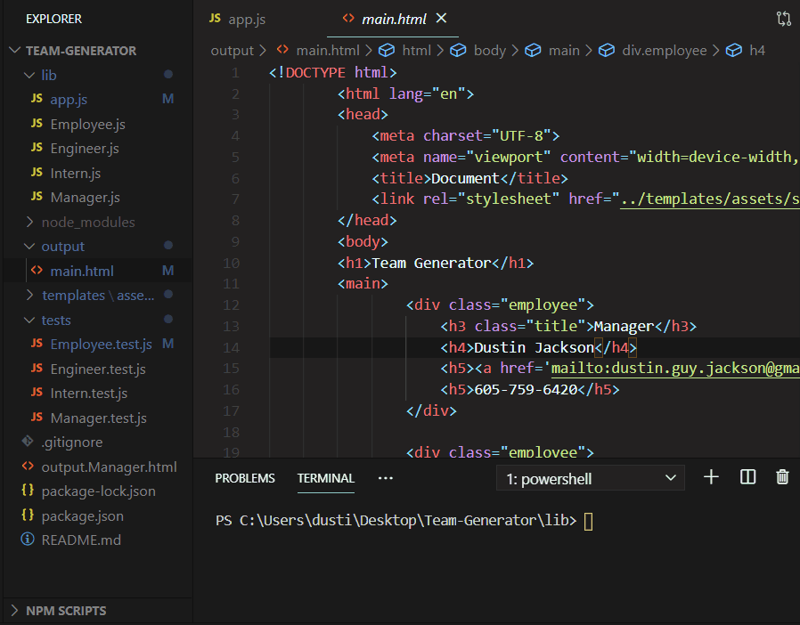
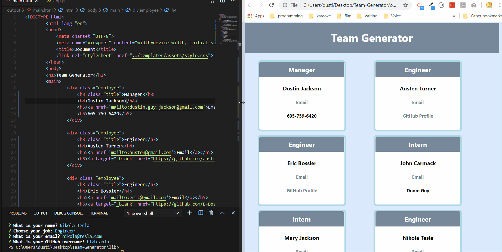
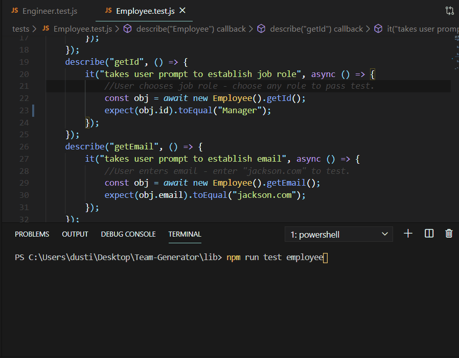

# Team-Generator
A command-line app that will generate a team-based profile.

### Initialize

The App runs by first asking how many members are on your team. Once answered, the output main.html file is re-written to start a new team profile.

For each member, choose between Manager, Engineer, or Intern. The app dynamically appends html to the file based on what was entered. After info has been entered for all members, the app will button the ending HTML on the end.

Once the app is done, simply launch the HTML in your default browser. You can see the simple website is dynamic and mobile-friendly. It will link to team member E-mails and GitHub profiles, granted the emails and profiles are real. 

Running the tests, all you need to do is enter the pre-determined prompts to pass. The engineer.js, manager.js, and intern.js tests also pass inheriting "employee.js" as their superclass. 
